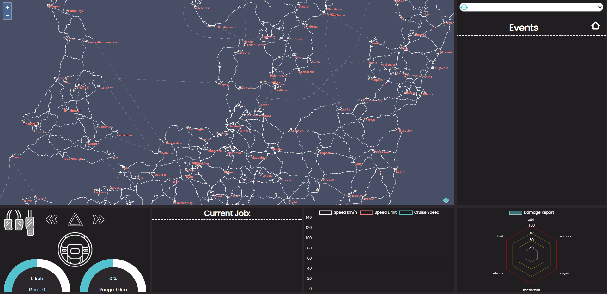

## Welcome, I’m El - a passionate developer based in the 📍UK.

**Learning programming has been my creative journey for years. Starting with Python & C#, I’ve explored the realms of full-stack web development, 3D art, digital art, and game development. This captivating voyage has allowed me to blend my passion for programming with my love for creating immersive visual experiences.**

### My main interests reside within:
⦾ Fullstack WebDev - I specialize in JS, HTML, CSS, JQuery, Express and Vite. Though i do like to integrate MongoDb from time to time.

 

⦾ 3D Modeling - I love spending some spare time bringing my ideas to life in blender.

 

⦾ Graphics Design - If im not making a website, working on a game or 3d Modeling; then im probably in photoshop or afterEffects making graphics for them.

---

Feel free to check out my <a href="https://elleburt.co.uk/">website</a> to learn more about me and my work. (Please note this is currently in the process of being overhauled to a MEVN stack) 😊

Get a sneak Peek: <a href="https://youtu.be/48X8b_JbK0M" target="_blank">here</a>  and  <a href="https://youtu.be/80LcKv-kZqY" target="_blank">Here</a>
 
 
Also, don’t forget to take a look at another site I worked on: <a href="http://www.trucklinkvtc.co.uk/" target="_blank">Trucklink VTC.</a>

Trucklink is a Realtime Data Streaming website that displays users in game data to a dashboard on the site, including: Speed, Events, Live Map Possitioning, and more!

Note: the image above displays the member only dashboard when no users are online, hence the lack of data. This also means its only accessible with the correct credentials. However there is a live map on the public route
---
# 🖥️ Tech Stack:
                 

